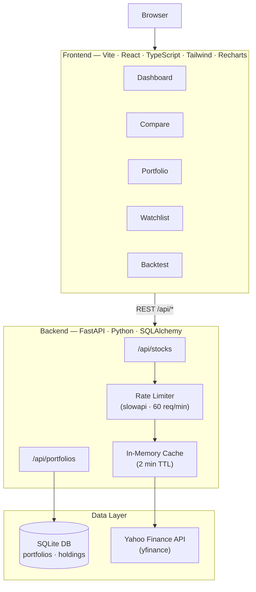

# Market Dashboard

[](https://github.com/anishonly121/market-dashboard/actions/workflows/ci.yml)


A full-stack financial dashboard that pulls real market data, tracks portfolios with live P&L, compares stocks, runs backtests, and measures its own usage with Mixpanel. Built in two phases: a Streamlit prototype first, then rebuilt as a proper FastAPI + React application.

**[Live Demo →](https://frontend-two-dun-61.vercel.app)** · **[GitHub →](https://github.com/anishonly121/market-dashboard)** · **[API Docs →](#api)**

---

## Screenshot

> _Add a screenshot or GIF here after running the app._
> `Tip: use ShareX (Windows) or LICEcap to record a GIF of the dashboard._`

---

## Architecture



---

## Features

### Phase 1 — Streamlit (`phase1-streamlit/`)
- Real-time stock quotes via Yahoo Finance (no API key needed)
- Candlestick + line charts with Moving Averages (20/50/200) and Bollinger Bands
- RSI oscillator panel
- Multi-stock comparison with normalized returns and correlation heatmap
- Session-based portfolio tracker with P&L and allocation charts

### Phase 2 — Full-Stack (`backend/` + `frontend/`)

| Area | What's included |
|------|----------------|
| **Dashboard** | Search any ticker · price/volume chart · MA overlays · 52-week range · key metrics |
| **Compare** | Normalize up to 6 stocks on one chart · preset groups (FAANG+, EVs, Chips, Banks) · sortable table |
| **Portfolio** | Create/delete portfolios · add/remove holdings · live P&L · allocation donut chart |
| **Watchlist** | localStorage-persisted ticker list · live prices and % changes |
| **Backtest** | "What if I'd invested $X N years ago?" · growth chart · CAGR · max drawdown |
| **Analytics** | Mixpanel event tracking (page views, searches, portfolio actions) |

---

## Tech Stack

| Layer | Technology | Why |
|-------|-----------|-----|
| Frontend framework | React 18 + TypeScript | Type safety catches bugs at compile time |
| Build tool | Vite | Near-instant HMR; much faster than CRA |
| Styling | Tailwind CSS | Utility classes keep the codebase lean |
| Charts | Recharts | Composable, React-native chart library |
| Data fetching | TanStack Query | Handles caching, refetch, and loading states cleanly |
| Backend | FastAPI | Automatic OpenAPI docs; async-ready; Pydantic validation |
| ORM | SQLAlchemy 2 | Typed models, easy migrations |
| Database | SQLite | Zero-setup for dev; swap to Postgres for prod with one line |
| Market data | yfinance | Free, no API key, covers 50k+ global tickers |
| Rate limiting | slowapi | Prevents hammering Yahoo Finance |
| Analytics | Mixpanel | Track real usage and iterate |

---

## Quick Start

### Phase 1 — Streamlit (fastest path to something working)

```bash
cd phase1-streamlit
python -m pip install -r requirements.txt
python -m streamlit run app.py
# Open http://localhost:8501
```

Or on Windows: double-click `start-phase1.ps1`

---

### Phase 2 — Full Stack

**1. Backend**

```bash
cd backend
python -m pip install -r requirements.txt

# Optional: seed a demo portfolio
python seed.py

# Start the API server
python -m uvicorn app.main:app --reload
# API docs: http://localhost:8000/docs
```

**2. Frontend**

```bash
cd frontend
npm install
npm run dev
# Open http://localhost:5173
```

Or on Windows: double-click `start.ps1` to launch both at once.

**3. Analytics (optional)**

```bash
cd frontend
cp .env.example .env.local
# Add your free Mixpanel token to VITE_MIXPANEL_TOKEN
```
Get a free token at [mixpanel.com](https://mixpanel.com) → create project → Project Settings.

---

## API Reference

| Method | Endpoint | Description |
|--------|----------|-------------|
| GET | `/api/stocks/{ticker}` | Current quote (price, change, metrics) |
| GET | `/api/stocks/{ticker}/history` | OHLCV bars (`?period=1y&interval=1d`) |
| GET | `/api/stocks/compare/many` | Normalized returns for multiple tickers |
| POST | `/api/portfolios` | Create portfolio |
| GET | `/api/portfolios` | List all portfolios |
| GET | `/api/portfolios/{id}` | Get portfolio |
| PUT | `/api/portfolios/{id}` | Update portfolio |
| DELETE | `/api/portfolios/{id}` | Delete portfolio |
| POST | `/api/portfolios/{id}/holdings` | Add / upsert holding |
| DELETE | `/api/portfolios/{id}/holdings/{hid}` | Remove holding |
| GET | `/api/portfolios/{id}/value` | Live portfolio valuation with P&L |

---

## Tests

```bash
# Backend (18 tests)
cd backend && python -m pytest tests/ -v

# Frontend (21 tests)
cd frontend && npm test -- --run
```

Tests run automatically on every push via GitHub Actions (see `.github/workflows/ci.yml`).

---

## Deploy

### Frontend — deployed ✅
Live at **https://frontend-two-dun-61.vercel.app**

To redeploy after changes: `cd frontend && vercel --prod --yes --scope bholeanish3-2351s-projects`

### Backend → Render (one-click)

[](https://render.com/deploy?repo=https://github.com/anishonly121/market-dashboard)

Or manually:
1. Go to [render.com](https://render.com) → **New → Web Service**
2. Connect `anishonly121/market-dashboard`
3. Root directory: `backend`, Build: `pip install -r requirements.txt`, Start: `uvicorn app.main:app --host 0.0.0.0 --port $PORT`
4. Add env var: `ALLOWED_ORIGINS=https://frontend-two-dun-61.vercel.app`
5. After deploy, copy your Render URL (e.g. `https://market-dashboard-api.onrender.com`)
6. Add `VITE_API_BASE_URL=https://market-dashboard-api.onrender.com` to Vercel env vars → redeploy frontend

### Phase 1 → Streamlit Community Cloud
1. Go to [share.streamlit.io](https://share.streamlit.io)
2. New app → repo `anishonly121/market-dashboard` → file `phase1-streamlit/app.py`
3. Click Deploy

---

## Project Decisions

**Why SQLite instead of Postgres?**
Zero setup for development. SQLAlchemy makes swapping to Postgres a one-line change (`DATABASE_URL` in `.env`). For a personal dashboard with one user, SQLite is the right tool.

**Why not use a real-time WebSocket feed?**
Yahoo Finance doesn't provide a real-time stream without a paid subscription. Polling every 60–120 seconds is honest about the data freshness and keeps the app free to run.

**Why in-memory caching instead of Redis?**
Redis adds operational complexity. A simple dict cache with a TTL achieves the same goal for a single-instance deployment. The abstraction (`_cached()` in `market_data.py`) makes swapping trivial later.

---

## What I Learned

- **Full-stack wiring**: how a typed API contract (Pydantic schemas ↔ TypeScript types) prevents an entire class of runtime bugs
- **SQL vs server defaults**: `server_default=func.now()` works in production but creates subtle test failures — Python-side defaults are more predictable
- **Testing strategy**: mocking external APIs (yfinance) at the right boundary makes tests fast and reliable without sacrificing coverage
- **Product analytics**: instrumenting your own project teaches you more about user behaviour than any tutorial — and it's a great story to tell
